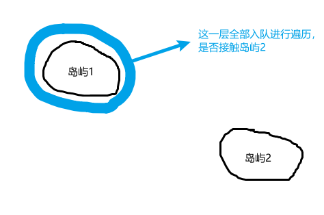
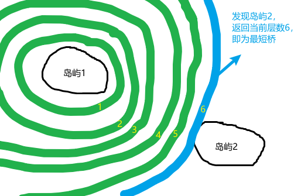

# [最短的桥](https://leetcode.cn/problems/shortest-bridge/)

# DFS + BFS

1. 首先找到一个岛
2. 然后利用BFS寻找下一个岛并计算距离

~~~java
class Solution {
    public int shortestBridge(int[][] grid) {
        int m = grid.length;
        int n = grid[0].length;
        boolean hasIsland = false;
        Queue<int[]> queue = new LinkedList<>();
        //DFS寻找一个岛屿，将该岛屿全部变为2
        for(int i = 0; i < m; ++i){
            //找到一块地并进行一次BFS即可
            if(hasIsland) break;
            for(int j = 0; j < n; ++j){
                if(grid[i][j] == 1){
                    dfs(queue, grid, i, j);
                    hasIsland = true;
                    break;
                }
            }
        }
        int[] direction = new int[]{-1, 0, 1, 0, -1};
        int ans = 0;
        //BFS寻找第二个岛屿并把0变成2
        while(!queue.isEmpty()){
            ++ans;
            //控制只遍历当前这一层（后续会入队后一层）
            int queueSize = queue.size();
            while(queueSize-- > 0){
                int[] water = queue.poll();
                for(int i = 0; i < 4; ++i){
                    int x = water[0] + direction[i];
                    int y = water[1] + direction[i + 1];
                    if(x >= 0 && y >= 0 && x < m && y < n){
                        if(grid[x][y] == 2){
                            continue;
                        }
                        if(grid[x][y] == 1){
                            return ans;
                        }
                        //入队后一层
                        queue.offer(new int[]{x, y});
                        //当前层遍历完成标记
                        grid[x][y] = 2;
                    }
                }
            }
        }
        return 0;
    }

    private void dfs(Queue<int[]> queue, int[][] grid, int x, int y){
        if(x < 0 || y < 0 || x >= grid.length || y >= grid[0].length || grid[x][y] == 2){
            return;
        }
        if(grid[x][y] == 0){
            //将岛屿边缘第一层全部入队
            queue.offer(new int[]{x, y});
            return;
        }
        grid[x][y] = 2;
        dfs(queue, grid, x + 1, y);
        dfs(queue, grid, x - 1, y);
        dfs(queue, grid, x, y + 1);
        dfs(queue, grid, x, y - 1);
    }
}

/*

[
    [0, 1],
    [1, 0]
]

[
    [1,1,1],
    [0,0,0],
    [0,0,1]
]

 */
~~~

## 过程

- 绿色为标记为2的点（已经搜索完）
- 蓝色为队列中的点
- 被首先发现的岛屿也标记为2，但这里为了区分没涂色

有两个岛屿，相互隔离：

假设先寻找到岛屿1，那么从岛屿1开始向外BFS：

进行逐层遍历：

发现岛屿2立即返回层数：

